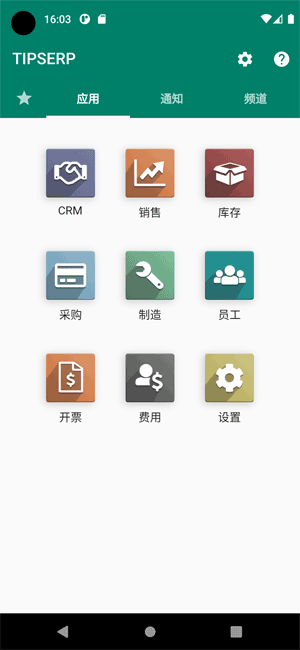
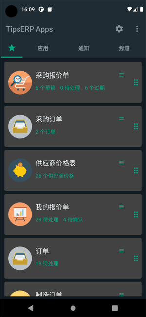
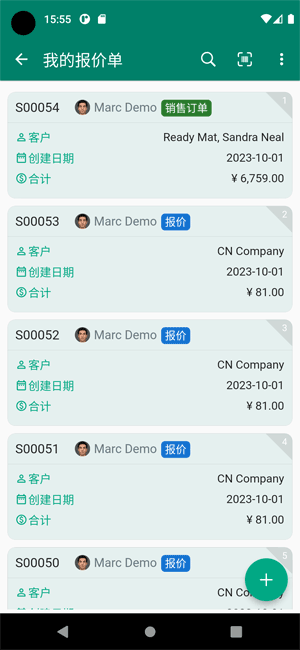
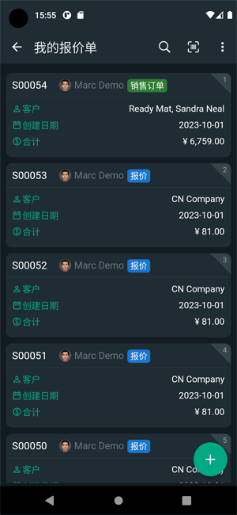
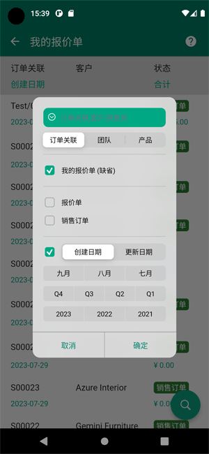
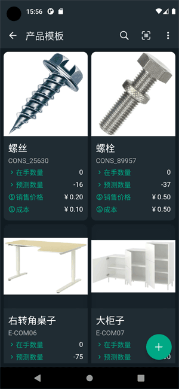

# Flutter Odoo App

This project is a Flutter application that connects to an Odoo server. It allows users to interact with the Odoo ERP system through a mobile interface.

## Features

- User authentication
- View and manage Odoo records
- Real-time data synchronization
- Push notifications
- Common modules: CRM, Sale, Stock, Purchase,MRP, Employee,
- Custom modules support

## Screenshots

Here are some screenshots of the app:

## Installation

You can install the app on Android or iOS devices.
